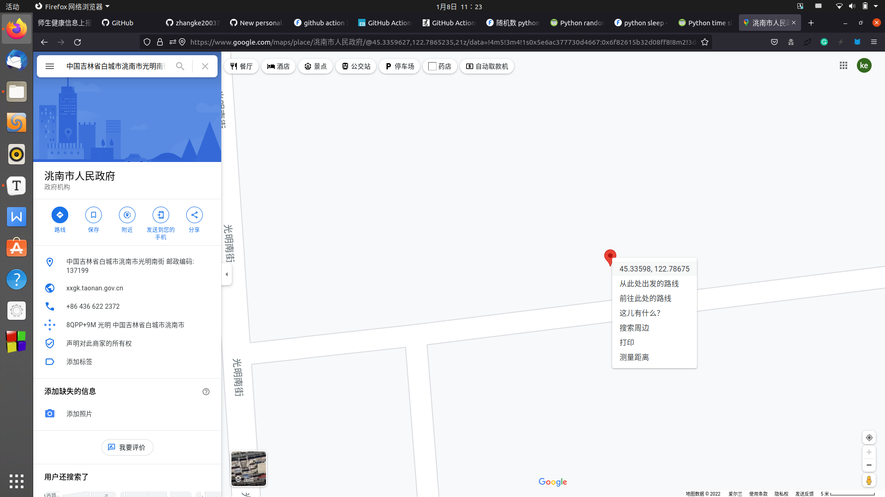

# neu_health_check
[](https://github.com/zhangke200377/neu_health_check/actions/workflows/action.yml)

东大健康上报自动化

自动帮助你每日上报健康信息。

相关的博客：[RE：从零开始的东大健康上报自动化（上）](https://lab.fangkehou.eu.org/re0_e_report/re0_health_1.html)

欢迎大家加入放课后的下午茶时间下午茶时间哦！欢迎大家一起闲聊吹水！QQ群号184431788

上报时间默认是上午七点五十，觉得不好可以自己改（但其实没什么不好的，毕竟写了延迟执行的，最多会延迟十分钟（600秒））

## 食用教程

#### 1. 准备需要的信息

- Github Personal Token

  进入个人设置=>开发者设置=>Personal Token页面，并建立一个新token（`Github 头像` => `Settings` => `Developer settings` => `Personal access tokens` => `Generate new token`）

  验证密码之后任意取名字，然后下方多选栏勾选 `repo` 、`workflow` 、`write:packages` 三项，然后点击 `Generate token` 按钮，最后在新页面中复制 "gh" 开头的字符串，即为Github Personal Token（注：Github Personal Token生成后只会展示一次，请妥善保管）

- 你家的省份以及你家附近的经纬度

  省份不过多解释，一定要带上“省”字，例如 “吉林省”，“辽宁省” 等

  经纬度的获取方法：

  - 打开 [谷歌地图 Google Maps](https://www.google.com/maps/) 获取你家的定位

  - 在你家所在位置鼠标右键，在右键菜单点击最上面一项

    

    > Google Map页面

    Google Map就会将你的经纬度复制下来，与刚才的Token一起妥善保管（否则你还得再翻一次 :-) ）

#### 2. 设置项目

- fork本项目到你自己的仓库中

- 设置项目sercet：

  - 在你自己的项目中依次点击 `Settings` => `secrets` => `New repository secret`

  - 建立如下7个sercet：

    | Name          | Value                     | 解释                                                         |
    | ------------- | ------------------------- | ------------------------------------------------------------ |
    | GH_TOKEN      | 你的Github Personal Token | 这个是要给日后开始签到之后文件夹里的days文件更新用的<br>（我懒得写天数的判断了，于是就做了这么个折中的办法） |
    | HOME          | 1或0                      | 是否在家（1是在家，0是不在，当不在家的时候程序会使用东大的坐标上报健康信息） |
    | MAP_LAT       | Google坐标中较小的数      | 纬度                                                         |
    | MAP_LON       | Google坐标中较大的数      | 经度                                                         |
    | PASSWORD      | 智慧东大密码              | 登录用                                                       |
    | USERNAME      | 智慧东大账号              | 登录用                                                       |
    | USER_PROVINCE | 用户省份                  | 你家所在省份                                                 |

  - 依次点击项目页面中 `Actions` => ` NEU Daily Health Check` => `Run workflow` => `Run workflow` 

- 接下来等待第一次执行成功之后每天都会重复执行了

## 特别说明

国际惯例：本项目仅供学习交流使用，请在下载代码之后24小时之内删除，对于由于使用本项目对任何团体及个人所造成的任何问题本人不承担任何责任。请注意：你所看到的包括用户名，项目名，README文件，项目代码，博客在内的所有具有文字的页面中的所有字符都是为了测试键盘性能随机打上去的，没有任何意义。

fangkehou惯例：~~（什么？你居然看到了这行不可见之字？）~~

```
社会主义核心价值观：

富强 民主 文明 和谐

自由 平等 公正 法治

爱国 敬业 诚信 友善
```

本项目以 `GPT-3` 协议开源，请在使用时遵守相关的要求


在使用该项目的过程中你可能会收到Github发给你的邮件，如果邮件内容为执行失败请转到项目页面重新检查secret是否设置完全并重新运行workflow
